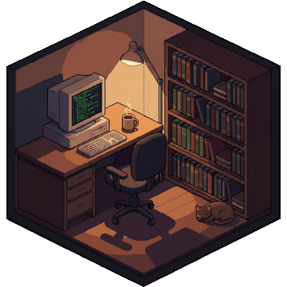

# PixelPet

A macOS menu bar app that shows a cozy pixel art room with a sleeping cat. Connect it to [Claude Code](https://claude.ai/claude-code) hooks to see real-time tool status on the retro computer screen.



## Features

- Pixel art isometric room in your menu bar
- Sleeping cat with floating `z z` animation
- Coffee steam, dust particles, keyboard glow effects
- **Real-time Claude Code status** — screen shows what Claude is doing:
  - `READ` — reading files
  - `WRITE` — writing/editing code
  - `RUN` — executing commands
  - `SEARCH` — searching codebase
  - `THINK` — other tools
  - `IDLE` → `SLEEP` after inactivity
- Pin mode (right-click menu bar icon) — keeps window always visible
- Calibration mode — double-click eye button to adjust screen overlay position
- Custom background support — replace `bg.png` with your own pixel art

## Install

### Option 1: Download Release (recommended)

1. Download the latest release from [Releases](../../releases)
2. Unzip and put the `pixel-pet` folder anywhere you like
3. **Right-click** `PixelPet.app` → **Open** (required first time, macOS security)
4. Click the 🤖 icon in your menu bar

### Option 2: Build from Source

Requires macOS with Xcode Command Line Tools.

```bash
git clone https://github.com/Tinkitsune/pixel-pet.git
cd pixel-pet
swiftc PixelPet.swift -o PixelPet.app/Contents/MacOS/PixelPet -framework Cocoa -framework WebKit
open PixelPet.app
```

## Connect to Claude Code

To see real-time tool status, add hooks to your Claude Code config:

### 1. Edit `~/.claude/settings.json`

Add the `hooks` section (update the path to where you placed the pixel-pet folder):

```json
{
  "hooks": {
    "PreToolUse": [
      {
        "matcher": "",
        "hooks": [
          {
            "type": "command",
            "command": "/path/to/pixel-pet/hook.sh"
          }
        ]
      }
    ]
  }
}
```

### 2. Restart Claude Code

That's it! The retro computer screen will now show what Claude is doing in real-time.

## Usage

| Action | Effect |
|--------|--------|
| **Left-click** 🤖 | Toggle popover window |
| **Right-click** 🤖 | Toggle pin mode (📌 = always visible) |
| **Double-click** 👁 | Enter calibration mode (click 4 screen corners) |

## Custom Background

Replace `bg.png` in the pixel-pet folder with your own image:
- Recommended size: **480 × 360** (4:3 ratio)
- Format: PNG or JPG
- Style: isometric pixel art works best
- Restart the app after replacing

Then use calibration mode to align the screen overlay to your new image.

## Requirements

- macOS 12+ (Monterey or later)
- Apple Silicon or Intel Mac

## How It Works

- `PixelPet.swift` — Single-file Swift app using Cocoa + WebKit
- `bg.png` — Background pixel art (embedded as base64 at build time)
- `hook.sh` — Claude Code hook script, writes tool state to `status.json`
- `status.json` — Polled by the app's JavaScript every 500ms via XHR
- `_pet.html` — Auto-generated HTML file loaded by WKWebView

## License

MIT
